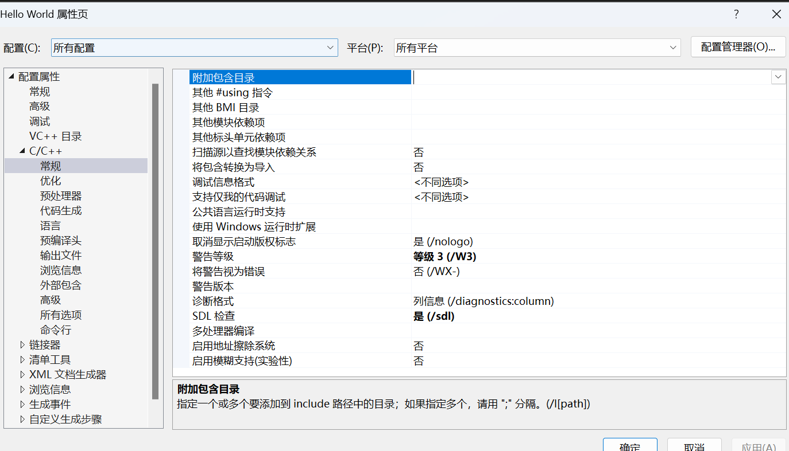
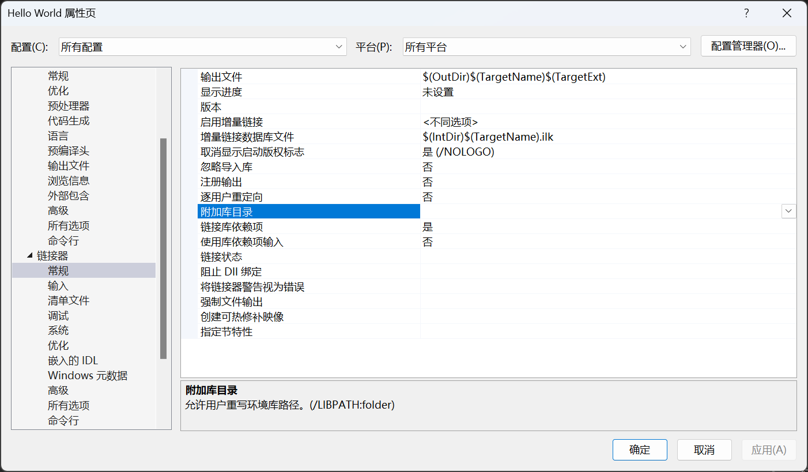
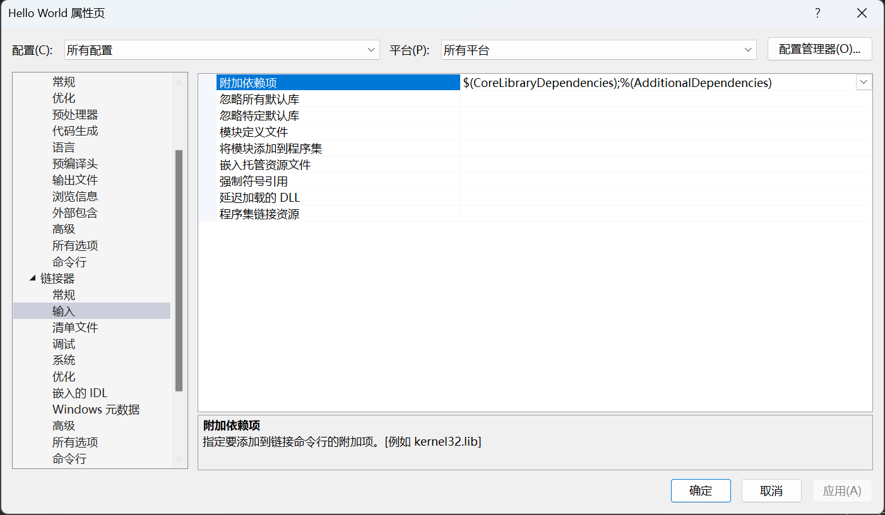

# VS相关

## 解决方案

# 工作流程

```cpp
#include <iostream>

int main(){
	std::cout<<"Hello World"<<endl;
	std::cin.get();
}
```

**预处理指令**：预处理器接收源代码，并处理源代码中的预处理指令。预处理指令是以 `#`开头的指令，例如 `#include`、`#define`等。预处理器会处理这些指令，例如包含头文件、处理宏定义等，然后生成预处理后的源代码。

**编译**：编译器接收预处理后的源代码，然后将源代码翻译成汇编代码。编译器在这个过程中会进行语法检查、类型检查、优化等操作。

**汇编**：将文本文件转换为机器码，.cpp文件会被编译，但.h文件不会，.h文件会在预处理阶段被“copy”到.cpp文件中，编译的结果是一个object文件，在windows系统中，是.obj文件

**链接**：链接器接收多个目标文件，然后将这些目标文件链接成一个可执行文件。链接器在这个过程中会解析目标文件中的符号（例如函数和变量的名称），并将这些符号链接到它们在可执行文件中的地址。此过程会将所有obj缝合，构建依赖关系，并形成exe文件。

# 数据类型

**整数类型** ：

* `short`: 通常占用2字节，取值范围通常为-32768到32767。
* `int`: 通常占用4字节，取值范围通常为-2147483648到2147483647。
* `long`: 在32位系统上通常占用4字节，在64位系统上通常占用8字节。
* `long long`: 通常占用8字节，取值范围通常为-9223372036854775808到9223372036854775807。

**字符类型** ：

* `char`: 占用1字节，取值范围通常为-128到127或0到255。
* `wchar_t`: 用于表示宽字符，通常占用2或4字节。

**浮点数类型** ：

* `float`: 占用4字节。
* `double`: 占用8字节。
* `long double`: 占用的字节数依赖于具体的实现，通常为8字节或12字节或16字节。

**布尔类型** ：

* `bool`: 占用1字节，取值为 `true`或 `false`。

**空类型** ：

* `void`: 无值，通常用于表示函数无返回值或指针无指向类型。

# 函数

函数基本结构

```C++
return_type function_name( parameter list ) {
   //body of the function
}
```

* `return_type`：这是函数返回的数据类型。如果函数不返回值，则返回类型为 `void`。
* `function_name`：这是函数的名称。函数名和参数列表共同构成了函数签名。
* `parameter list`：这是传递给函数的参数列表，参数可以是任何类型，包括基本类型、复合类型、指针、引用等。参数列表可以为空。
* `body of the function`：这是函数的主体，包含了函数的具体实现。

函数可以被定义在其他函数之外（全局函数），也可以被定义在类或结构体中（成员函数）。函数可以被其他函数调用，也可以递归地调用自身。

函数可以被声明为 `inline`，这会建议编译器将函数体直接插入到每个调用点，以减少函数调用的开销。

函数可以被声明为 `constexpr`，这表示函数可以在编译时计算结果，这对于模板元编程和编译时计算非常有用。

函数可以被声明为 `virtual`，这表示函数可以被子类覆盖。如果函数被声明为 `pure virtual`，则该函数没有默认实现，必须由子类提供实现。

# 头文件

头文件是一种源代码文件，通常包含函数声明、宏定义、类型定义（如类、结构体和枚举的定义）等。头文件的主要目的是提供接口，使得源代码文件可以共享和重用代码。

头文件通常具有 `.h`或 `.hpp`扩展名（在C++中）。当你在源代码文件中使用 `#include`预处理指令来包含头文件时，预处理器会将整个头文件的内容复制到该指令的位置。

例如，如果你有一个名为 `my_functions.h`的头文件，其中包含了一些函数的声明，你可以在另一个源代码文件中使用以下指令来包含这个头文件：

**#include** **"my_functions.h"**

这样，你就可以在这个源代码文件中调用 `my_functions.h`中声明的函数了。

注意，为了防止头文件的内容在同一编译单元中被多次包含，通常会在头文件中使用预处理指令 `#ifndef`、`#define`和 `#endif`来设置包含保护。例如：

```cpp
#ifndef MY_FUNCTIONS_H
#define MY_FUNCTIONS_H

// function declarations, type definitions, etc.

#endif
```

这样，即使在同一源代码文件中多次包含这个头文件，头文件的内容也只会被包含一次。

**#pragma once 是使得头文件只被包含一次**

"" 一般用于相对位置，但也可包含<>的作用

<>用于包含编译器定义的文件目录

# 指针

指针本质上就是一个整数，该整数指定了内存地址（存放变量的起始地址），指针的类型仅仅指定了访问时所取的内存长度

```cpp
int x = 10;
int* p = &x;  // p是一个指向x的指针// 解引用p，获取x的值
int y = *p;  // y现在是10// 通过解引用p来修改x的值
*p = 20;  // x现在是20
```

# 引用

引用可以被理解为指针的一种语法糖，和指针没有本质区别，可被理解为指针的简化写法

# 类

类（class）是一种用户定义的数据类型，它封装了数据和操作数据的函数。类提供了面向对象编程的基础，包括封装、继承和多态

```cpp
class MyClass {
public:
    MyClass(int a) : a(a) {}  // 构造函数  
int getA() const { return a; }  // 成员函数  
void setA(int a) { this->a = a; }  // 成员函数private:
    int a;  // 数据成员
};
```

## 类和结构体

最主要区别在于默认的访问权限，class为私有，struct为公有

当需要一个全公开的数据结构，倾向于使用结构体

## 构造、析构

* 构造函数是一种特殊的成员函数，它在创建类的新对象时被调用。构造函数的名称与类的名称相同，没有返回类型
* 析构函数是一种特殊的成员函数，它在一个对象即将被销毁时被调用。析构函数的名称是类的名称前面加上一个波浪符（~）

```cpp

class MyClass {
public:
    MyClass() {
        std::cout << "Object is created" << std::endl;
    }

    ~MyClass() {  // 析构函数
        std::cout << "Object is destroyed" << std::endl;
    }
};
```

## 友元函数和友元类

1. **友元函数** ：友元函数是定义在类外部，但有权访问类的所有私有和保护成员的函数。友元函数不是类的成员函数，也不受类的访问控制规则约束，但需要在类内部进行声明。

```cpp
class MyClass {
private:
    int secret = 0;public:
    friend void revealSecret(MyClass& mc);  // 声明友元函数
};
void revealSecret(MyClass& mc) {  // 定义友元函数
    std::cout << mc.secret << std::endl;
}
```

2. **友元类** ：友元类的所有成员函数都可以访问其友元类的私有和保护成员。声明类B为类A的友元，只需要在类A的定义中包含 `friend class B;`。

```cpp
class A {
private:
    int secret = 0;

public:
    friend class B;  // 声明B为A的友元类
};

class B {
public:
    void revealSecret(A& a) {  // B可以访问A的私有成员
        std::cout << a.secret << std::endl;
    }
};
```

友元提供了一种逃避C++的封装性的机制。

然而，过度使用友元可能会导致代码的维护性和可读性降低，因此应谨慎使用。

## 访问控制、可见性

public：公有成员在类的内部和外部都是可见的

private：私有成员只在类的内部可见。你不能在类的外部访问或修改私有成员。

protect：受保护成员在类的内部和其派生类中可见

# static

1. **静态局部变量** ：在函数内部，`static`关键字可以用来声明静态局部变量。这些变量在程序的生命周期内只被初始化一次，而不是每次调用函数时都被初始化。它们的值在函数调用之间保持不变。

```cpp
void func() {
    static int x = 0;
    x++;
    std::cout << x << std::endl;
}
```

2. **静态类成员** ：在类中，`static`关键字可以用来声明静态成员变量和静态成员函数。静态成员变量在所有类的实例中共享，而静态成员函数没有 `this`指针，只能访问类的静态成员。

```cpp
class MyClass {
public:
    static int x;

    static void func() {
        x++;
    }
};

int MyClass::x = 0;  // 静态成员变量需要在类外部初始化
```

3. **静态全局变量和函数** ：在全局作用域中，`static`关键字可以用来限制变量或函数的链接范围到当前文件。这意味着，静态全局变量或函数在其他文件中是不可见的。

```cpp
static int x = 0;  // 只在当前文件可见

static void func() {  // 只在当前文件可见
    x++;
}
```

这些是 `static`关键字在C++中的主要用法。需要注意的是，`static`关键字的具体含义取决于它的上下文。

# enum枚举类

枚举（enum）是一种用户定义的类型，它由一组命名的整数常量组成。

枚举类（enum class）是C++11引入的一种新的枚举类型，它提供了更强的类型安全和更好的作用域规则。

```cpp
enum class Color {
    Red,
    Green,
    Blue
};
```

# 数组

```
int myArray[5];  // 声明一个大小为5的int数组
```

数组本质上是指向首地址的指针

数据的数据类型指定了该类型访问内存的方式

例如int则会以四个字节为单位进行分割访问

delete数组时应使用delete[]，因为数组名本身仅是一个指针，它指向的是首地址

# 字符串

字符串本质上就是一个char的数组

双引号定义字符串时，默认是const char*

字符串末尾默认定义\0作为终止符

## 字符串前后缀

1. **u8前缀** ：`u8`前缀用于创建UTF-8编码的字符串字面量。

```CPP
auto s = u8"Hello, world!";
```

2. **u前缀** ：`u`前缀用于创建UTF-16编码的字符串字面量。

```CPP
auto s = u"Hello, world!";
```

3. **U前缀** ：`U`前缀用于创建UTF-32编码的字符串字面量。

```CPP
auto s = U"Hello, world!";
```

4. **L前缀** ：`L`前缀用于创建宽字符字符串字面量。

```cpp
auto s = L"Hello, world!";
```

5. **R前缀** ：`R`前缀用于创建原始字符串字面量，原始字符串字面量中的所有字符都被视为字面字符，不会被转义。

```cpp
auto s = R"(Hello, \n world!)";  // 输出：Hello, \n world!**
```

6. **s后缀** ：`s`后缀用于创建 `std::string`对象，而不是C风格的字符串。

```cpp
using namespace std::string_literals;
auto s = "Hello, world!"s;
```

# const

在C++中，`const`关键字用于声明一个常量，即其值在初始化后不能被修改。`const`可以用于修饰变量、指针、引用、函数参数、函数返回值以及类的成员函数。

1. **修饰变量** ：当 `const`修饰一个变量时，该变量的值不能被修改。

```cpp
const int a = 10;
// a = 20;  // 错误：不能修改常量的值
```

2. **修饰指针** ：`const`可以修饰指针本身或指针所指向的对象。

```cpp
int value = 5;
const int* p1 = &value;  // p1是一个指向常量的指针，不能通过p1修改value的值
int* const p2 = &value;  // p2是一个常量指针，不能修改p2的值（即它指向的地址）
const int* const p3 = &value;  // p3是一个指向常量的常量指针，既不能通过p3修改value的值，也不能修改p3的值
```

3. **修饰引用** ：`const`可以修饰引用，创建一个常量引用，常量引用不能被用来修改其绑定的对象的值。

```cpp
int value = 5;
const int& ref = value;  // ref是一个常量引用，不能通过ref修改value的值
```

4. **修饰函数参数** ：`const`可以修饰函数参数，表示该参数在函数内部不能被修改。

```cpp
void foo(const int param) {
    // param = 10;  // 错误：不能修改常量参数的值
}
```

5. **修饰函数返回值** ：`const`可以修饰函数返回值，表示返回的值不能被修改。

```cpp
const int foo() {
    return 10; 
}// foo() = 20;  // 错误：不能修改常量的值
```

6. **修饰类的成员函数** ：`const`可以修饰类的成员函数，表示该成员函数不能修改类的任何成员变量（除非它们被声明为 `mutable`）。

```cpp

class Foo {
    int value;
public:
    int getValue() const {  // getValue是一个常量成员函数，不能修改类的任何成员变量
        // value = 10;  // 错误：不能在常量成员函数中修改成员变量的值
        return value;
    }
};
```

# mutable

## 修改const变量

在C++中，`mutable`是一个关键字，它用于指定一个类成员可以在一个 `const`成员函数中被修改。

通常，`const`成员函数不能修改类的任何成员变量。但是，如果你有一个成员变量，即使在 `const`成员函数中也需要被修改，你可以使用 `mutable`关键字。

```cpp
class Foo {
    mutable int counter;
public:
    Foo() : counter(0) {}    void increment() const {
        counter++;  // OK，因为counter是mutable的
    }    int getCounter() const {
        return counter;
    }
};
```

## 修饰lambda表达式

`mutable`关键字也可以用于lambda表达式。当一个lambda表达式捕获的变量被声明为 `mutable`时，这个变量可以在lambda表达式的函数体中被修改，即使lambda表达式本身是一个 `const`函数。

```cpp
int x = 0;
auto lambda = x mutable {
    x++;  // OK，因为x是mutable的
    return x;
};
int y = lambda();  // y的值为1，但原始的x的值仍然为0
```

```cpp
int x = 0;
auto lambda = x { 
    x++;  // 错误，因为x不是mutable的
    return x;
};
```

# 初始化列表

成员初始化列表是一种在类构造函数中初始化成员变量的方式。它允许你在构造函数体执行之前初始化成员变量。

成员初始化列表有几个优点：

* **效率** ：对于类类型的成员变量，使用成员初始化列表可以避免先调用默认构造函数然后再调用赋值运算符的额外开销。
* **const和引用成员** ：`const`成员变量和引用成员变量必须在构造时初始化，它们不能在构造函数体中赋值。成员初始化列表提供了一种初始化这些成员变量的方式。

```cpp
class Foo {
    const int x;  // const成员变量
    int& y;  // 引用成员变量
public:
    Foo(int a, int& b) : x(a), y(b) {  // 使用成员初始化列表初始化x和y
        // 构造函数体
    }    int getX() const { return x; }
    int getY() const { return y; }
};int main() {
    int value = 5;
    Foo foo(10, value);
    std::cout << "x: " << foo.getX() << ", y: " << foo.getY() << std::endl;
    return 0;
}
```

* **父类和成员对象的初始化** ：如果你的类继承自其他类，或者包含其他类的对象，你可以使用成员初始化列表来调用这些类的构造函数。
* **初始化顺序控制** ：成员变量的初始化顺序由它们在类定义中的顺序决定，而不是它们在成员初始化列表中的顺序。使用成员初始化列表可以避免因初始化顺序不正确导致的问题。

# ？语法糖

```cpp
int x = 10;
int y = 20;
int max = (x > y) ? x : y;  // 如果x > y，max为x，否则max为y
```

# new

`new`操作符在C++中的工作原理可以分为两个主要步骤：

1. **内存分配** ：`new`操作符首先在堆上分配足够的内存来存储指定类型的对象。这通常通过调用底层的内存管理函数（如C++的 `::operator new`或C的 `malloc`）来完成。
2. **对象构造** ：一旦内存被分配，`new`操作符会调用对象的构造函数来初始化对象。这意味着在内存分配之后，对象的成员变量会被初始化，任何必要的构造代码都会被执行。

```cpp
int* ptr = new int;  // 分配一个int大小的内存，并返回指向该内存的指针
int* array = new int[10];  // 分配一个包含10个int的数组，并返回指向该数组的指针
```

# 构造函数隐式转换

如果一个类的构造函数只需要一个参数，那么这个构造函数可以被用作隐式类型转换。这意味着C++编译器将自动使用这个构造函数将给定类型的值转换为这个类的对象。

```cpp
class MyClass {
public:
    MyClass(int value) { 
        // ...
    }
};void foo(MyClass obj) {
    // ...
}int main() {
    foo(42);  // 隐式转换：int被转换为MyClass
    return 0;
}
```

隐式转换可能会导致意外的结果。为了防止构造函数被用作隐式类型转换，可以在构造函数前面加上 `explicit`关键字。

```cpp
class MyClass {
public:
    explicit MyClass(int value) {
        // ... 
    }
};void foo(MyClass obj) {
    // ...
}int main() {
    foo(42);  // 错误：不能将int隐式转换为MyClass
    foo(MyClass(42));  // 正确：显式转换
    return 0;
}
```

# 运算符重载

运算符重载是C++中的一个特性，允许程序员改变某些运算符的行为，使它们能够用于自定义类型（如类）。

运算符重载通过定义一个或多个特殊的成员函数或非成员函数来实现。

```cpp
class Complex {
    double real, imag;
public:
    Complex(double r, double i) : real(r), imag(i) {}
    Complex operator+(const Complex& other) const {
        return Complex(real + other.real, imag + other.imag);
    }
};
```

# 智能指针

* **`std::unique_ptr`**：这是一种独占所有权的智能指针，也就是说，同一时间只能有一个 `std::unique_ptr`指向一个给定的对象。当 `std::unique_ptr`被销毁时，它会删除它所指向的对象。
* **`std::shared_ptr`**：这是一种共享所有权的智能指针，也就是说，多个 `std::shared_ptr`可以指向同一个对象。`std::shared_ptr`使用引用计数来跟踪有多少个智能指针指向同一个对象。当最后一个指向对象的 `std::shared_ptr`被销毁时，它会删除该对象。
* **`std::weak_ptr`**：这是一种不拥有所有权的智能指针，它指向一个由 `std::shared_ptr`拥有的对象。`std::weak_ptr`不会增加对象的引用计数，因此它不会阻止对象被删除。它通常用于解决 `std::shared_ptr`的循环引用问题。

## 循环引用问题


```cpp
class B;

class A {
public:
    std::shared_ptr<B> b_ptr;
};

class B {
public:
    std::shared_ptr<A> a_ptr;
};

int main() {
    std::shared_ptr<A> a(new A());
    std::shared_ptr<B> b(new B());
    a->b_ptr = b;
    b->a_ptr = a;
}  // a和b在这里离开作用域

```

当离开作用域时

指针a会被析构，此时a的引用计数减1

后指针b被析构，此时b的引用计数减1

此时堆上出现了A、B两个对象，并且互相有一个指针指向对方，但用户已无法获取其内存地址，造成了内存泄漏

# 静态链接和动态链接

## 静态链接：

在项目中附加包含目录，指定头文件路径，并在使用处#include
该步骤实现了函数声明的引入，但不包括函数实现



链接器链接，在附加库目录中指定静态库的路径，并在input中附加依赖项指定库的名称，使程序正确链接到静态链接库






## 动态链接

其他操作与静态库相同，但在附加依赖项中，写入动态库对应的lib，并将dll文件复制到exe文件的同名路径


