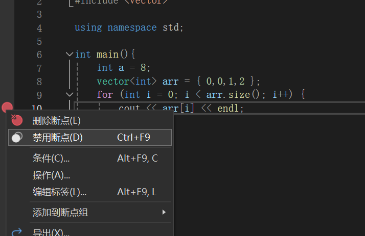

# 多返回值处理

在C++中，有几种方法可以返回多个值：

**使用std::pair或std::tuple** ：这是一种常见的方法，特别是当你需要返回的值的数量是固定的，并且不太多时。例如：

```cpp
#include <utility>  // for std::pair

std::pair<int, double> foo() {
    return {1, 2.3};
}
```

   或者使用 `std::tuple`来返回更多的值：

```cpp
#include <tuple>  // for std::tuple

std::tuple<int, double, std::string> bar() {
    return {1, 2.3, "hello"};
}
```

**使用std::vector或std::array** ：当你需要返回的值的数量是固定的，并且所有的值都是同一类型时，你可以使用 `std::vector`或 `std::array`。例如：

```cpp
#include <vector>  // for std::vector

std::vector<int> foo() {
    return {1, 2, 3};
}
```

**使用结构体或类** ：如果你需要返回的值有逻辑上的关联，你可以定义一个结构体或类来存储这些值。例如：

```cpp
struct Result {
    int a;
    double b;
};

Result foo() {
    return {1, 2.3};
}
```

# 模板

在C++中，模板是一种特性，允许程序员编写通用的代码，这些代码可以处理多种数据类型。

模板可以应用于函数（称为函数模板）和类（称为类模板）。

* **函数模板** ：函数模板是一种函数，它可以用多种类型的参数进行调用。例如，你可以编写一个函数模板来实现一个通用的交换函数：

```cpp
template <typename T>
void swap(T& a, T& b) {
    T temp = a;
    a = b;
    b = temp;
}
```

   在这个例子中，`T`是一个模板参数，表示一个类型。你可以用任何类型的参数调用 `swap`函数，只要这个类型支持赋值操作。

* **类模板** ：类模板是一种类，它可以用多种类型的参数进行实例化。例如，你可以编写一个类模板来实现一个通用的对（pair）：

```cpp
template <typename T1, typename T2>
struct Pair {
    T1 first;
    T2 second;
};
```

* **可变参数模板**#include `<iostream>`

# 内存管理：堆、栈

在C++中，内存主要分为两部分：堆（Heap）和栈（Stack）。

 **栈（Stack）** ：

栈是由编译器自动分配和释放的，存放函数的参数值，局部变量等。其操作方式类似于数据结构中的栈。

* 栈内存分配和释放非常快速，由编译器自动管理，无需手动操作。
* 栈空间有限，Windows下一般为1MB。如果分配的数据过大，比如大数组，可能会导致栈溢出。
* 栈上的对象在其作用域结束后会自动释放。

```cpp
void some_function() {
    int i;  // 局部变量，存放在栈上
}
```

 **堆（Heap）** ：

堆是由程序员分配和释放的，如果程序员不释放，程序结束时可能由OS回收。在C++中，利用new和delete进行动态内存分配。

* 堆空间大，受限于计算机系统中有效的虚拟内存。
* 分配方式类似于链表。
* 分配速度较慢，并且容易产生内存碎片。
* 不正确的使用堆会导致内存泄漏或者指针错误。

```cpp
int* p = new int;  // 在堆上分配内存
delete p;  // 释放堆上的内存
```

总结，栈和堆都是程序运行时使用的内存，但它们的分配方式、生命周期和大小都有所不同。栈由编译器自动管理，用于存放小而快速的局部变量；堆由程序员手动管理，用于存放大的数据或者生命周期不确定的数据。

# 宏

**本质上就是文本替换**

在C++中，宏是预处理器（preprocessor）的一部分，它在编译阶段之前对代码进行处理。宏有多种用途，包括：

**定义常量** ：宏常用于定义常量，这样可以在代码中多次使用这个常量，而不需要每次都写出它的值。

```cpp
#define PI 3.14159
```

**条件编译** ：宏可以用于条件编译，即根据特定的条件决定是否编译某部分代码。这在处理平台差异、调试和测试等情况时非常有用。

```cpp
#ifdef DEBUG
    // 这部分代码只在DEBUG被定义时编译
#endif
```

**简化代码** ：宏可以用于简化复杂的代码，或者创建“函数式”的代码片段。但是，这种用法应该谨慎使用，因为宏不会进行类型检查，而且可能会引入复杂的副作用。

```cpp
#define SQUARE(x) ((x) * (x))
```

虽然宏在某些情况下很有用，但是它也有一些缺点，比如类型不安全、可能引入复杂的副作用、不易调试等。因此，现代C++编程中，宏的使用被其他特性所取代，比如常量可以用 `const`或 `constexpr`定义，条件编译可以用模板和配置文件处理，简化代码可以用内联函数或者模板

# auto

`auto`是C++11引入的一个关键字，用于自动类型推导。在声明变量时，如果使用 `auto`作为类型，编译器会自动推导出变量的实际类型。

```cpp
auto i = 42;  // i的类型被推导为int
auto d = 42.0;  // d的类型被推导为double
auto s = "hello";  // s的类型被推导为const char*

std::vector<int> vec = {1, 2, 3};
auto begin = vec.begin();  // begin的类型被推导为std::vector<int>::iterator
```

需要注意的是，`auto`推导的类型会忽略顶层const和引用，如果需要保留这些类型修饰符，可以使用 `const auto&`或者 `auto&&`。

```cpp
const int ci = 42;
auto a = ci;  // a的类型被推导为int，忽略了const
const auto& b = ci;  // b的类型被推导为const int&
```

另外，`auto`也可以用于函数返回类型的推导，这在处理复杂的模板函数时非常有用。

# 函数指针

## 基础指针

```cpp
void hello() {
    std::cout << "Hello, world!" << std::endl;
}

int main() {
    void (*fp)();  // 声明一个函数指针，指向一个没有参数也没有返回值的函数
    fp = hello;  // 让函数指针指向hello函数
    fp();  // 通过函数指针调用函数
}

```

```cpp
int add(int x, int y) {
    return x + y;
}int main() {
    int (*fp)(int, int);  // 声明一个函数指针，指向一个有两个int参数并返回int的函数
    fp = add;  // 让函数指针指向add函数
    int sum = fp(2, 3);  // 通过函数指针调用函数
    std::cout << sum << std::endl;  // 输出5
}
```

## std::function

`std::function`是C++11引入的一个模板类，它可以用来存储任何可以调用的对象，包括函数、函数指针、成员函数指针、函数对象和lambda表达式。

以下是一些 `std::function`的使用例子：

**存储函数** ：

```cpp
double square(double x) {
    return x * x;
}

std::function<double(double)> func = square;
std::cout << func(10) << std::endl;  // 输出100
```

**存储函数指针** ：

```cpp
double (*fp)(double) = square;
std::function<double(double)> func = fp;
std::cout << func(10) << std::endl;  // 输出100
```

**存储成员函数指针** ：

```cpp
struct Foo {
    double square(double x) {
        return x * x;
    }
};

Foo foo;
std::function<double(Foo*, double)> func = &Foo::square;
std::cout << func(&foo, 10) << std::endl;  // 输出100
```

**存储函数对象** ：

```cpp
struct Square {
    double operator()(double x) {
        return x * x;
    }
};

std::function<double(double)> func = Square();
std::cout << func(10) << std::endl;  // 输出100
```

**存储lambda表达式** ：

```cpp
std::function<double(double)> func = [](double x) {
    return x * x;
};
std::cout << func(10) << std::endl;  // 输出100
```

`std::function`的主要优点是灵活性，它可以存储任何可以调用的对象。但是，这种灵活性也有代价，`std::function`的使用可能会比直接使用函数指针或函数对象有更大的开销。因此，在性能敏感的代码中，你可能需要考虑直接使用函数指针或函数对象。

## bind

## 函数回调

直接使用函数指针传递参数

```cpp
#include <iostream>

void callback(int x, void (*fp)(int)) {
    fp(x);
}

void print(int x) {
    std::cout << x << std::endl;
}

int main() {
    callback(10, print);  // 输出10
}
```

使用bind

```cpp
#include <iostream>
#include <functional>

struct Foo {
    void print(int x) {
        std::cout << x << std::endl;
    }
};

void callback(int x, const std::function<void(int)>& fp) {
    fp(x);
}

int main() {
    Foo foo;
    auto fp = std::bind(&Foo::print, &foo, std::placeholders::_1);
    callback(10, fp);  // 输出10
}
```

# 多线程

## 线程启动和创建

```cpp
#include <iostream>
#include <thread>

void hello() {
    std::cout << "Hello, world!\n";
}

int main() {
    std::thread t(hello);
    t.join();  // 等待线程结束
}

```

## 生产者-消费者模型

## 锁及条件变量

条件变量（std::condition_variable）和互斥锁（std::mutex）都是C++中用于线程同步的工具
互斥锁（std::mutex）：互斥锁用于保护共享数据，防止多个线程同时访问。当一个线程拥有一个互斥锁时，其他试图拥有该锁的线程将被阻塞，直到拥有锁的线程释放锁。
条件变量（std::condition_variable）：条件变量用于线程间的同步。一个或多个线程可以等待某个条件变量，直到另一个线程修改了共享数据并通知条件变量。
这两者通常一起使用：一个线程修改共享数据，并使用条件变量通知其他线程；其他线程使用互斥锁保护共享数据，并等待条件变量。
条件变量是对锁的进一步精确控制的补充

```cpp
#include <iostream>
#include <queue>
#include <thread>
#include <mutex>
#include <condition_variable>

std::queue<int> produced_nums;
std::mutex mtx;
std::condition_variable cv;
bool done = false;

void producer(int n) {
    for (int i = 0; i < n; ++i) {
        std::this_thread::sleep_for(std::chrono::milliseconds(900));  // 生产者比消费者慢
        std::lock_guard<std::mutex> lock(mtx);
        std::cout << "producing " << i << std::endl;
        produced_nums.push(i);
        cv.notify_all();  // 通知等待的消费者
    }
    done = true;
    cv.notify_all();  // 通知消费者停止
}

void consumer() {
    while (!done) {
        std::unique_lock<std::mutex> lock(mtx);
        cv.wait(lock, []{ return !produced_nums.empty() || done; });  // 等待直到有数据可消费或者生产者停止
        while (!produced_nums.empty()) {
            std::cout << "consuming " << produced_nums.front() << std::endl;
            produced_nums.pop();
        }
    }
}

int main() {
    std::thread producer_thread(producer, 10);  // 生产10个数据
    std::thread consumer_thread(consumer);

    producer_thread.join();
    consumer_thread.join();

    return 0;
}
```

# lambda表达式

```cpp
auto lambda = [](int x, int y) { return x + y; };
```

1. **空捕获列表** ：`[]`。这表示lambda表达式不捕获任何外部变量。
2. **值捕获** ：`[var]`。这表示lambda表达式以值方式捕获外部变量 `var`。这意味着 `var`的当前值在lambda表达式创建时就被复制了，后续对 `var`的修改不会影响到lambda表达式内部的值。
3. **引用捕获** ：`[&var]`。这表示lambda表达式以引用方式捕获外部变量 `var`。这意味着lambda表达式内部可以访问和修改 `var`的值，这些修改会影响到lambda表达式外部的 `var`。
4. **捕获所有外部变量** ：`[=]`表示以值方式捕获所有外部变量，`[&]`表示以引用方式捕获所有外部变量。
5. **混合捕获** ：你可以在捕获列表中混合使用值捕获和引用捕获。例如，`[var1, &var2]`表示以值方式捕获 `var1`，以引用方式捕获 `var2`。
6. **默认捕获模式** ：你可以设置一个默认的捕获模式（值或引用），然后为特定的变量设置不同的模式。例如，`[=, &var]`表示默认以值方式捕获所有变量，但是以引用方式捕获 `var`。
7. **捕获this指针** ：`[this]`表示捕获当前对象的this指针。这在成员函数中创建lambda表达式时很有用，因为它允许lambda表达式访问当前对象的成员。
8. **捕获初始化** ：从C++14开始，你可以在捕获列表中初始化新的变量。例如，`[x = 42]`在捕获列表中创建了一个新的变量 `x`，并初始化为42。

# 命名空间

在C++中，命名空间是用于组织代码的一种方式，它可以避免命名冲突。命名空间可以包含变量、函数、类和其他命名空间。

```cpp
namespace MyNamespace {
    int myVar = 42;
    void myFunction() {
        // 函数实现
    }
}
```

成员访问

```cpp
int var = MyNamespace::myVar;
MyNamespace::myFunction();
```

命名空间引入

```cpp
using MyNamespace::myVar;  // 引入特定成员
using namespace MyNamespace;  // 引入整个命名空间
```

过度使用 `using namespace`可能会导致命名冲突，因此在大型项目中通常不推荐这样做。

命名空间可以嵌套：

```cpp
namespace Outer {
    int outerVar = 42;
    namespace Inner {
        int innerVar = 24;
    }
}
```

嵌套命名空间引入

```cpp
int var1 = Outer::outerVar;
int var2 = Outer::Inner::innerVar;
```

# 计时

`std::chrono`是C++标准库中的一个命名空间，它提供了一套用于表示和处理时间的工具。

1. **Durations（持续时间）** ：`std::chrono::duration`是一个模板类，用于表示一段时间。它有两个模板参数：一个表示时间的数值，另一个表示这个数值的单位（例如秒、毫秒等）。例如，`std::chrono::duration<int, std::milli>`表示以毫秒为单位的时间。
2. **Time points（时间点）** ：`std::chrono::time_point`是一个模板类，用于表示一个时间点。它有两个模板参数：一个表示时钟（见下文），另一个表示从时钟的起点到这个时间点的持续时间。
3. **Clocks（时钟）** ：`std::chrono`提供了几种不同的时钟，用于获取当前时间和测量时间。例如，`std::chrono::system_clock`表示系统的实时时钟，`std::chrono::steady_clock`表示一个始终向前的时钟（即不受系统时间调整的影响）。

```cpp
#include <iostream>
#include <chrono>

int main() {
    auto start = std::chrono::high_resolution_clock::now();

    // 这里放你想要测量的代码

    auto end = std::chrono::high_resolution_clock::now();
    std::chrono::duration<double> diff = end - start;

    std::cout << "Time to run the code: " << diff.count() << " s\n";
}

```

为了实现更快速地计时，通常会将其封装在一个timer类中，并通过在构造和析构函数中赋值的方式快速调用

# 联合体/Variant

联合体（Union）是一种特殊的数据类型，它允许在相同的内存位置存储不同的数据类型。你可以把联合体看作是一个结构体，其中所有的成员共享同一块内存。

联合体的大小等于其最大成员的大小。也就是说，联合体的大小足够大，可以存储其任何成员。但是，任何时候只有一个成员的值是有效的。

```cpp
union MyUnion {
    int i;
    double d;
    char c;
};


```

`std::variant`是C++17引入的一种新特性，它是 `union`的安全版本。`std::variant`可以存放多种类型的数据，一次只能存放一种，但是它会记住当前存放的是哪种类型的数据。

```cpp
std::variant<int, double, std::string> data;
data = 10;  // 现在，data存放的是一个int
data = 3.14;  // 现在，data存放的是一个double
data = "Hello";  // 现在，data存放的是一个std::string
```

# 强制类型转换

在C++中，有四种强制类型转换（也称为类型转换操作符）：

1. **static_cast** ：这是最常用的类型转换操作符。它可以在任何的数据类型之间进行转换，但是转换的类型需要是相关的或者兼容的。例如，你可以将一个整数转换为一个浮点数，或者将一个派生类的指针转换为基类的指针。它在编译期实现转换，不会进行类型检查

```cpp
int i = 42;
double d = static_cast<double>(i);  // 将int转换为double
```

2. **dynamic_cast** ：这个操作符主要用于处理多态。运行时转换，会进行类型检查当你需要将一个基类的指针（或引用）转换为派生类的指针（或引用）时，可以使用 `dynamic_cast`。如果转换失败，`dynamic_cast`会返回 `nullptr`。

```cpp
Base* basePtr = new Derived();
Derived* derivedPtr = dynamic_cast<Derived*>(basePtr);  // 将Base*转换为Derived*
```

3. **const_cast** ：这个操作符用于移除常量性。也就是说，你可以使用 `const_cast`将一个 `const`类型的指针（或引用）转换为非 `const`类型的指针（或引用）。

```cpp
const int* constPtr = new int(42);
int* ptr = const_cast<int*>(constPtr);  // 移除const
```

4. **reinterpret_cast** ：这个操作符用于进行低级别的类型转换。它会产生一个新的值，这个值在位级别上与原值相同，但是类型可能完全不同。`reinterpret_cast`通常用于进行一些依赖于实现的、不可移植的操作。

```cpp
int i = 42;
int* ptr = &i;
long address = reinterpret_cast<long>(ptr);  // 将int*转换为long
```

# 条件和操作断点

在不终止程序的情况下调试




# 预编译头文件

在Visual Studio中使用预编译头文件的一个例子：

首先，你需要创建一个预编译头文件，例如"pch.h"，并在其中包含你想要预编译的头文件：

```

```

```cpp
// pch.h
#ifndef PCH_H
#define PCH_H

// 添加你想要预编译的头文件
#include <iostream>
#include <vector>
#include <string>

#endif // PCH_H
```

然后，你需要创建一个源文件"pch.cpp"，并在其中包含"pch.h"：

```cpp
// pch.cpp
#include "pch.h"
```

# 结构化绑定


结构化绑定（Structured Binding）是C++17引入的一种新特性，它允许你一次性声明多个变量，并将它们初始化为某个对象的成员或元素。

例如，你可以使用结构化绑定来解构一个 `std::pair`或 `std::tuple`：

```cpp
std::pair<int, std::string> p = {42, "Hello"};
auto [num, str] = p;  // num是int，str是std::string
```

你也可以使用结构化绑定来解构一个数组：

```cpp
int arr[] = {1, 2, 3};
auto [x, y, z] = arr;  // x, y, z都是int
```

此外，你还可以使用结构化绑定来解构一个结构体：

```cpp
struct Point {
    int x;
    int y;
};

Point p = {1, 2};
auto [x, y] = p;  // x, y都是int
```

在这些例子中，`auto [x, y]`和 `auto [x, y, z]`就是结构化绑定。它们会创建新的变量 `x`、`y`和 `z`，并将它们初始化为 `p`或 `arr`的成员或元素。

需要注意的是，结构化绑定创建的变量是新的变量，它们并不是原对象的引用。如果你想要创建引用，你可以使用 `auto&`或 `auto&&`：

```cpp
auto& [x, y] = p;  // x, y都是对p的成员的引用
```

# optional返回值处理

```cpp
std::optional<int> find(const std::vector<int>& vec, int target) {
    for (int i = 0; i < vec.size(); ++i) {
        if (vec[i] == target) {
            return i;  // 找到目标，返回其索引
        }
    }
    return std::nullopt;  // 找不到目标，返回空的optional
}

auto idx = find(vec, target);
if (idx.has_value()) {
    std::cout << "Found at index " << idx.value() << '\n';
} else {
    std::cout << "Not found\n";
}
```
