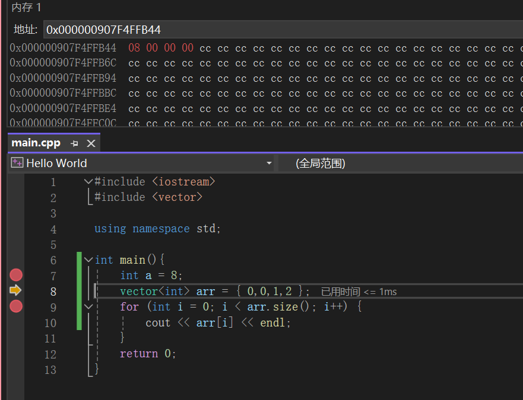
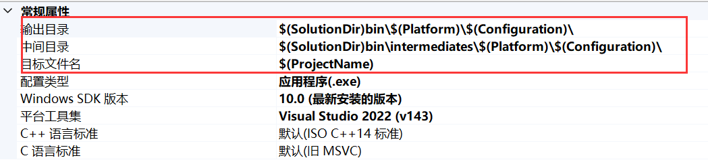

# Visual Stuido 2022

## 断点

* **F5** ： 运行
* **F9** ：设置或清除断点。它将在该行设置一个断点
* **F10** ：步过。调试器将执行当前行的代码，并在下一行停止。
* **F11** ：步入。调试器将执行当前行的代码，并在下一行或函数内部（如果当前行是一个函数调用）停止。

## 内存视图

一般来说，调试模式下，会用十六进制数CC来填充内存，说明其未初始化

## 大小端字节存储？

在计算机中，整数是以二进制形式存储的。当你设置 `int a = 8`，实际上在内存中存储的是8的二进制表示，即 `00001000`。

然而，一个字节（Byte）有8位（Bit），所以这个二进制数会被填充到一个字节中，变成 `00001000`。而一个 `int` 类型在大多数编程语言中是4字节（32位），所以这个数会被填充到4个字节中，变成 `00000000 00000000 00000000 00001000`。

然后，由于你的计 `noexcept`对于移动构造函数和移动赋值操作符特别重要。这是因为在某些情况下，例如当容器需要重新分配内存时，只有标记为 `noexcept`的移动操作才会被调用算机使用小端序，这4个字节在内存中的顺序会被反转，变成 `00001000 00000000 00000000 00000000`。

最后，当这个数被转换为十六进制表示时，每4位二进制数会被转换为一个十六进制数，所以 `00001000` 被转换为 `08`，而 `00000000` 被转换为 `00`。因此，最终的结果是 `08000000`。

## 推荐设置

