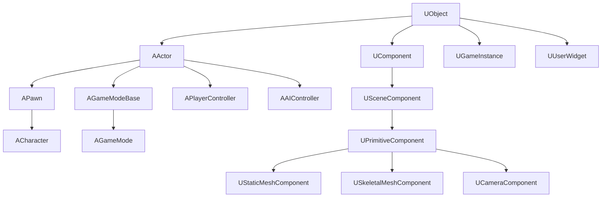

# UE组件类结构图

### 解释

* **UObject** ：所有UE类的基类。
* **AActor** ：游戏世界中所有可放置对象的基类。
* **APawn** ：可由玩家或AI控制的Actor。
  * **ACharacter** ：具有行走、跑步、跳跃等功能的Pawn。
* **AGameModeBase** ：定义游戏规则和逻辑的基类。
  * **AGameMode** ：更复杂的游戏规则和逻辑管理。
* **APlayerController** ：控制玩家Pawn的类。
* **AAIController** ：控制AI Pawn的类。
* **UComponent** ：所有组件的基类。
* **USceneComponent** ：具有位置、旋转和缩放功能的组件基类。
  * **UPrimitiveComponent** ：所有可渲染和碰撞组件的基类。
  * **UStaticMeshComponent** ：用于渲染静态网格的组件。
  * **USkeletalMeshComponent** ：用于渲染和控制骨骼网格的组件。
  * **UCameraComponent** ：表示相机视角的组件。
* **UGameInstance** ：整个游戏实例的全局状态和管理类。
* **UUserWidget** ：用于创建用户界面的小部件基类。
